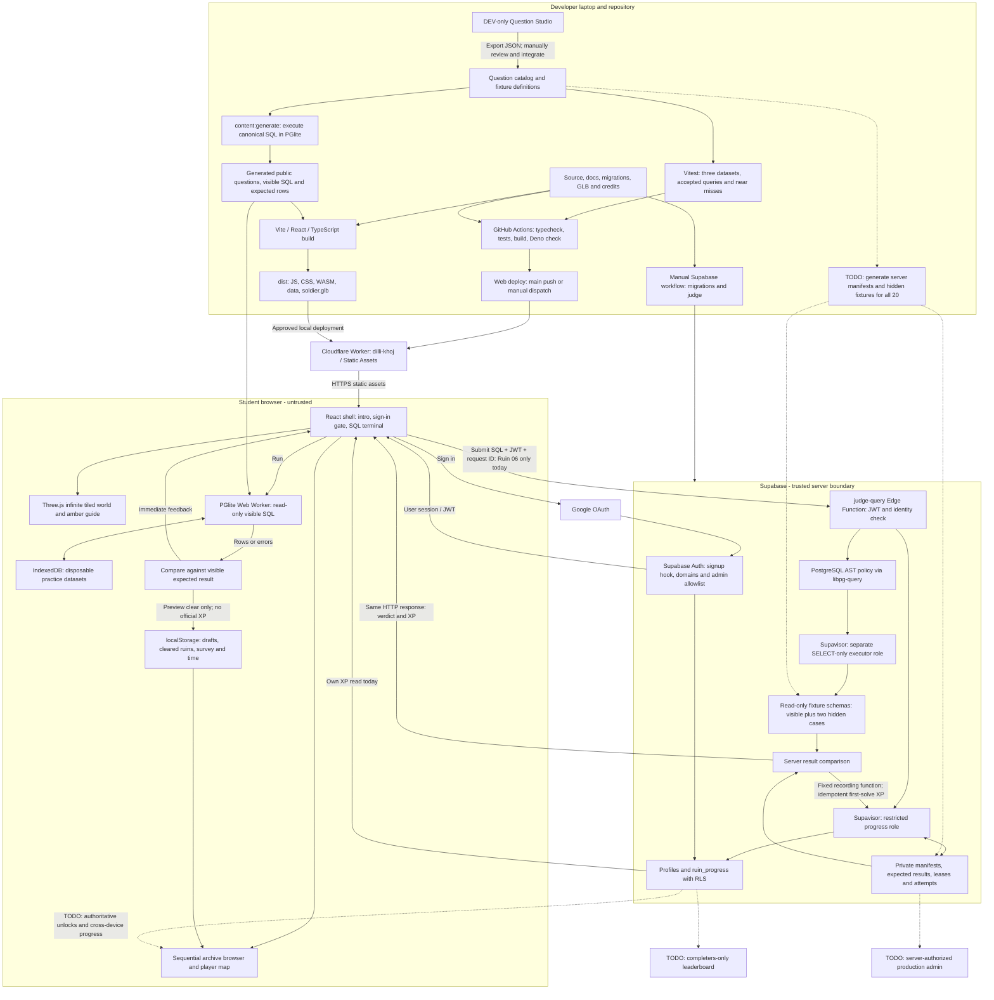

# Dilli Khoj

Dilli Khoj is a classroom-friendly PostgreSQL treasure hunt set in a fictional, post-collapse Delhi. Students explore twenty ruins, practise against PostgreSQL in the browser, and submit safe read-only queries to an authoritative hidden-case judge.

Current milestone: **all 20 ruins playable locally**; authoritative grading live for Ruin 06.

## What works now

- Roamable 3D overgrown-ruins world (Three.js): animated character, third-person orbit camera, wind-swept grass, guide arrows to the nearest amber archive, procedural ambience, and a first-run how-to-play overlay.
- All 20 ruins are playable through a sequential archive browser: clear the current ruin's visible case to open the next in the local preview; revisit cleared ruins from the personal map. SQL drafts and preview progress are browser-local, not yet isolated by signed-in user or synced between devices.
- Three datasets per question; the visible case's expected rows are computed by real PostgreSQL. Canonical/authoring solutions are excluded from production builds.
- Authoritative Edge Function judge (PostgreSQL 17 parsing, hidden cases, idempotent XP, restricted roles) — grades **Ruin 06**; ruins 1–5 and 7–20 are drafted and await server fixtures.
- Infinite tiled world, seven districts, sign-in gate (when configured), and personal progress map. The XP economy is encoded (`src/game/scoring.ts`), but paid help and authoritative progression across all ruins are not wired yet.
- Admin **Question Studio** (dev-only, `#admin`): every ruin tagged by level/district/topic, each with its visible test case; edit and add questions locally and export JSON to commit.
- CI (typecheck, tests, build, Deno judge check) and Cloudflare/Supabase deploy workflows.

Deployment snapshot from the maintainer handoff, 4 September 2026: Google sign-in, Supabase migrations, judge secrets and the Ruin 06 judge are reported live. The Cloudflare site serves an **older build**, not all features on this branch. This documentation pass verified local code/tests, not the remote dashboards. See [implementation status](docs/implementation-status.md).


## Project architecture

Solid arrows show the implemented paths; dotted arrows show unfinished integrations. Local preview progress is deliberately distinguished from trusted server progress.



Security boundaries: student SQL never runs under the progress identity; hidden rows and canonical solutions never enter the student bundle. The dev studio is **not** a production admin authorization mechanism. Sign-in currently allows three configured domains at signup, but the judge still checks only two; that mismatch is the first functional fix in [next steps](docs/next-steps.md).

### Source map

| Area | Main files |
| --- | --- |
| App, auth gate, world and map | `src/App.tsx`, `src/game/SignInGate.tsx`, `RuinScene.tsx`, `environment.ts`, `PlayerMap.tsx` |
| Curriculum, sequencing and scoring model | `src/game/ruins.ts`, `progression.ts`, `scoring.ts`, `practice-session.ts` |
| Content generation and regression cases | `src/questions/`, `scripts/practice-*.mjs`, `scripts/generate-practice.mjs` |
| Browser SQL | `src/db/`, `src/sql/`, `src/components/ResultTable.tsx` |
| Auth and judge client | `src/lib/supabase.ts`, `src/lib/judge.ts` |
| Server grading and database | `supabase/functions/judge-query/`, `supabase/functions/_shared/`, `supabase/migrations/`, `supabase/tests/` |
| Hosting and automation | `wrangler.jsonc`, `.github/workflows/` |

## Next steps, in order

1. Preserve the unpushed branch and browser-only authoring exports before moving laptops.
2. Align signup/judge authorization for all three domains and approved admins; test allowed and rejected identities.
3. Generate and validate authoritative manifests and all three fixtures for all 20 ruins.
4. Make progress, sequential unlocks, survey, paid hints/reveals and completion time server-authoritative; isolate local drafts by user.
5. Implement genuine revisit variants, then the completion leaderboard and secured production admin.
6. Update browser/security tests, load-test the free tier, and verify MacBook/browser performance.
7. With explicit owner approval, finish auth rollout checks and deploy a reviewed build; do not treat the existing live URL as launch readiness.

Acceptance criteria and known gaps are in [the ordered roadmap](docs/next-steps.md).

## Run locally


```bash
pnpm install --frozen-lockfile
cp -n .env.example .env.local
pnpm dev
```

Use `http://localhost:5173` for the configured OAuth redirect. With a real publishable key, the how-to overlay is followed by Google sign-in; development also offers a local bypass. Without a configured key, development practice remains available. Replace the placeholder in `.env.local` with the Supabase browser publishable key. Never place a secret/service-role key in a `VITE_` variable. Installing on another laptop does not require recreating the hosted database or OAuth client.

## Author questions (dev only)

Open `http://localhost:5173/#admin` while running `pnpm dev` for the **Question Studio**: every ruin tagged by level, district and topic, with its visible test case. Edit or add questions there (changes persist in the browser) and use **Export JSON** to save them for committing. This view and all canonical solutions are stripped from production builds. Regenerate the practice fixtures/expected rows with:

```bash
pnpm content:generate
```

## Verify

```bash
pnpm test
pnpm typecheck
pnpm build
```

The build emits PGlite's PostgreSQL WebAssembly and data files. They are the dominant payload; preload the game before a synchronized classroom launch.

## Deploy the static shell

Production origin: `https://dilli-khoj.example.workers.dev`

```bash
pnpm deploy
```

Deploy only after `.env.local` contains the intended publishable key and the Supabase URL allowlist includes the production origin. Wrangler authentication remains in the developer's local account; no Cloudflare token belongs in Git.

## Continuous integration and deployment

GitHub Actions workflows live in `.github/workflows/`:

- **`ci.yml`** — runs on every push and pull request. Typechecks the browser, node and edge-function projects, runs the vitest suite, builds the production bundle, and type-checks the judge under the Deno runtime it deploys on. No secrets required.
- **`deploy-web.yml`** — deploys the static game shell to Cloudflare Workers Static Assets on pushes to `main` (or manual dispatch). The publishable key is inlined at build time, then the pinned Wrangler deploys `dist/`.
- **`deploy-supabase.yml`** — **manual only** (`workflow_dispatch`). Pushes database migrations and deploys the `judge-query` Edge Function, with per-run toggles for each. Kept off automatic triggers so schema changes are always deliberate.

### Required GitHub configuration

Set these in **Settings → Secrets and variables → Actions** before deploying.

| Kind | Name | Used by | Notes |
| --- | --- | --- | --- |
| Secret | `CLOUDFLARE_API_TOKEN` | deploy-web | Token with "Edit Cloudflare Workers" permissions |
| Secret | `CLOUDFLARE_ACCOUNT_ID` | deploy-web | Cloudflare account id |
| Secret | `VITE_SUPABASE_PUBLISHABLE_KEY` | deploy-web | Browser publishable key (`sb_publishable_...`) |
| Variable | `VITE_SUPABASE_URL` | deploy-web | e.g. `https://your-project-ref.supabase.co` |
| Secret | `SUPABASE_ACCESS_TOKEN` | deploy-supabase | Supabase personal access token |
| Secret | `SUPABASE_DB_PASSWORD` | deploy-supabase | Database password for `db push` |
| Variable | `SUPABASE_PROJECT_REF` | deploy-supabase | e.g. `your-project-ref` |

The publishable key is safe in the browser bundle; still store it as a secret so it is not printed in logs. **Never** add a Supabase secret/service-role key, a database URL, or the two judge-role passwords to Actions — the judge-role passwords and the `JUDGE_*_DATABASE_URL` Edge Function secrets are configured manually per `docs/setup-supabase-google.md`, and `deploy-supabase.yml` assumes they already exist server-side.

## Documentation

- [Ordered development roadmap](docs/next-steps.md)
- [Product specification](docs/product-spec.md)
- [Curriculum and twenty-ruin map](docs/curriculum-map.md)
- [Question authoring and tests](docs/question-authoring.md)
- [Submission architecture](docs/submission-architecture.md)
- [Implementation status](docs/implementation-status.md)
- [Deployment runbook (zero to live URL)](docs/deployment-runbook.md)
- [Supabase and Google setup](docs/setup-supabase-google.md)
- [Decisions and open items](docs/decisions-and-open-items.md)

## Repository rules

1. Every ruin must map to `docs/curriculum-map.md` and meet `docs/question-authoring.md`.
2. Browser **Run** is free and untrusted; only server **Submit** changes progression.
3. Never commit database passwords, OAuth secrets, Supabase secret keys or Cloudflare tokens.
4. Infrastructure changes update the architecture and setup docs in the same change.
5. Keep the game educational, playful and classroom-friendly, with limited humour.
