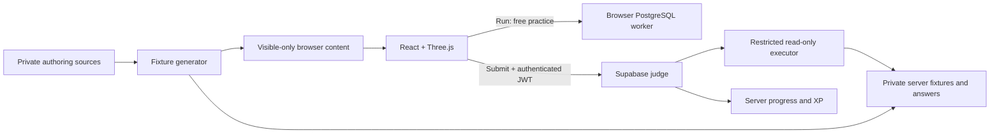

# Dilli Khoj

A PostgreSQL learning game set in a fictional, overgrown Delhi. Students explore a 3D world, restore twenty archives, and practise the DBMS curriculum through SQL.

**Status: development preview, not ready for a classroom-wide release.** This branch implements all twenty server-graded questions and trusted progression. The hosted handoff reports an older Ruin 06-only judge; the new implementation has not been deployed.

## Scope

- Twenty ruins across seven districts, following curriculum Modules 1–8.
- Read-only SQL: `SELECT` and `WITH … SELECT`, including aggregates, windows, subqueries and joins.
- Unlimited local practice in browser PostgreSQL (PGlite).
- Hidden-case server grading, sequential progression and an XP economy.
- Topic-matched revisits, completers-only leaderboard and restricted read-only administration.
- Target cohort: up to 3,000 students on modern Mac browsers; ₹0 operating target.

Art direction inspiration from [Exceletia by edusatyaki](https://github.com/edusatyaki/Exceletia). See [credits](CREDITS.md) for shipped assets and attribution.

## Run locally

See [setup instructions](docs/setup.md) for prerequisites, browser configuration, checks and troubleshooting.

```bash
git clone --branch build/foundation https://github.com/gv1shnu/treasure-hunt.git
cd treasure-hunt
nvm install
nvm use
npm install --global pnpm@11.19.0
pnpm install --frozen-lockfile
cp -n .env.example .env.local
pnpm dev
```

Open **http://localhost:5173**. Development supports offline practice and a local sign-in bypass. For Google sign-in, use the existing project's **browser publishable key** in `.env.local`; never use a secret/service-role key. Production blocks play when auth configuration is absent.

## What works and what remains

| Area | Current state |
| --- | --- |
| World | Infinite tiled landscape, animated Soldier, navigation, ambience and personal map |
| Questions | All 20 playable locally; three generated test datasets per question |
| Authorization | Shared three-domain/admin policy tested locally; real OAuth and rollout pending |
| Server grading | All 20 implemented and exercised against local PostgreSQL; three cases per question |
| Progress and XP | Server transactions own unlocks, awards and purchases; local Run is untrusted |
| Drafts | Browser-local, scoped by account; no cross-device synchronization |
| Help and revisits | Paid server help; two non-scoring alternate objectives per ruin |
| Administration | Audited server-protected reads; content editing through DEV studio and reviewed source |
| Release validation | 98 tests and Chromium checks pass; clean local load is fast, but full Supabase and sustained mixed-load validation remain |

The live site may serve an older build. A working preview does not establish capacity for 3,000 simultaneous students. PGlite's WASM/data payload is substantial; campus download capacity and free database compute need measurement.

## Architecture



Student SQL runs under a restricted execution role, separate from the identity that records progress. Canonical solutions and hidden data belong to private authoring/server sources and must not enter student production assets. Repository access therefore includes authoring answers; give students the deployed app, not this source repository.

## Team guide

| Read this | For |
| --- | --- |
| [Setup](docs/setup.md) | Get a new laptop running and validate it |
| [Product specification](docs/product-spec.md) | Player loop, scoring, privacy and intended scope |
| [Curriculum map](docs/curriculum-map.md) | The twenty ruins and their learning targets |
| [Implementation status](docs/implementation-status.md) | Verified features and known gaps |
| [Navigation and performance review](docs/navigation-and-performance-review.md) | App/repository paths, map review and SQL evaluation flow |
| [Next steps](docs/next-steps.md) | Ordered development and release checklist |
| [Question authoring](docs/question-authoring.md) | Writing, fixtures, equivalent SQL and review requirements |
| [Submission architecture](docs/submission-architecture.md) | Judge contracts, trust boundaries and performance constraints |
| [Decisions](docs/decisions-and-open-items.md) | Settled choices and unresolved product decisions |
| [Deployment](docs/deployment-runbook.md) | Maintainer-only release process |

Code entry points: `src/App.tsx` (game shell), `src/game/` (world/progression), `src/questions/` and `scripts/` (content), `supabase/functions/` (judge), `supabase/migrations/` (database).

## Working on the project

```bash
pnpm typecheck
pnpm test
pnpm build
test -s dist/models/soldier.glb
```

Keep curriculum order, the infinite world and Soldier's `MODEL_YAW_OFFSET` intact. Regenerate computed content instead of editing expected answers by hand. Update relevant docs alongside behavioral changes. Use personal Git identities and review staged files before committing.

Feature-branch pushes run CI. Merging to `main` triggers the web deployment workflow; backend deployment is manual. Deployment, live migrations, credential changes and paid services require the owner's explicit approval.
