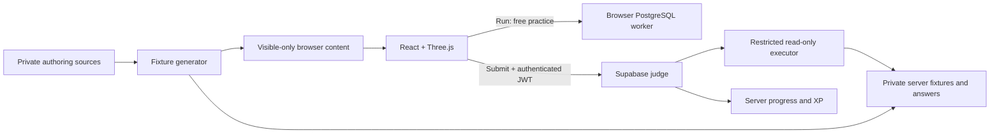

# Dilli Khoj

A PostgreSQL learning game set in a fictional, overgrown Delhi. Students explore a 3D world, restore twenty archives, and practise the DBMS curriculum through SQL.

**Status: hosted preview, not yet cleared for a classroom-wide release.** All twenty server-graded questions, the full judge and trusted progression are now deployed to the hosted backend (Supabase) and web (Cloudflare); the earlier Ruin-06-only judge has been replaced. Native-browser and accessibility QA, sustained hosted-load validation and blind human review of every question remain before a classroom rollout.

## Scope

- Twenty ruins across seven districts, following curriculum Modules 1–8.
- Read-only SQL: `SELECT` and `WITH … SELECT`, including aggregates, windows, subqueries and joins.
- Unlimited local practice in browser PostgreSQL (PGlite).
- Hidden-case server grading, sequential progression and an XP economy.
- Topic-matched revisits, a live explorer count, completers-only leaderboard and restricted read-only administration.
- Target cohort: up to 3,000 students on modern Mac browsers; ₹0 operating target.

See [credits](CREDITS.md) for shipped assets and attribution.

## Run locally

See [setup instructions](docs/setup.md) for prerequisites, browser configuration, checks and troubleshooting.

```bash
git clone https://github.com/gv1shnu/treasure-hunt.git
cd treasure-hunt
nvm install
nvm use
npm install --global pnpm@11.19.0
pnpm install --frozen-lockfile
cp -n .env.example .env.local
pnpm dev
```

Open **http://localhost:5173**. Development supports offline practice and a local sign-in bypass. For Google sign-in, use the existing project's **browser publishable key** in `.env.local`; never use a secret/service-role key. Production blocks play when auth configuration is absent.

## What works and what remains

| Area               | Current state                                                                                               |
| ------------------ | ----------------------------------------------------------------------------------------------------------- |
| World              | Infinite tiled landscape, animated Soldier, navigation, ambience and an animated geographic atlas           |
| Questions          | All 20 playable locally; three generated test datasets per question                                         |
| Authorization      | Shared three-domain/admin policy tested locally; real OAuth and rollout pending                             |
| Server grading     | All 20 implemented and exercised against local PostgreSQL; three cases per question                         |
| Progress and XP    | Server transactions own unlocks, awards and purchases; local Run is untrusted; the HUD shows a live explorer count |
| Drafts             | Browser-local, scoped by account; no cross-device synchronization                                           |
| Help and revisits  | Paid server help; two non-scoring alternate objectives per ruin                                             |
| Map access         | Cleared regions only for players; full atlas for admin inspection                                           |
| Administration     | Audited server-protected reads; content editing through DEV studio and reviewed source                      |
| Release validation | 157 tests plus Chrome/WebKit MacBook checks pass; full Supabase and sustained hosted-load validation remain |

The hosted build now serves the full twenty-question judge. A working preview does not establish capacity for 3,000 simultaneous students. PGlite's WASM/data payload is substantial; campus download capacity and free database compute need measurement.

## Architecture



Student SQL runs under a restricted execution role, separate from the identity that records progress. Canonical solutions and hidden data belong to private authoring/server sources and must not enter student production assets. Repository access therefore includes authoring answers; give students the deployed app, not this source repository.

## Repository guide

```text
src/            Browser app: App.tsx (shell, archive flow, XP, maps); game/ (3D scene,
                movement, ambience, progression, and world/ with the twenty levels);
                db/ (PGlite practice worker); questions/ (authored catalog + generated
                public content); sql/ (query/result policy); lib/ (Supabase client,
                game RPCs, judge calls); admin/ (DEV-only Question Studio); components/
scripts/        Content generators, browser checks and local judge harnesses
supabase/       functions/judge-query/ (grading Edge Function), functions/_shared/
                (judge policies), migrations/ (ordered schema, fixtures, RPCs),
                tests/ (SQL authorization and judge contracts)
public/         Static build assets      docs/  Specs, evidence, plans and runbooks
```

`dist/`, `node_modules/`, `.wrangler/` and `supabase/.temp/` are generated or local state, not authored source.

**Runtime flow.** `src/main.tsx` mounts React; [src/App.tsx](src/App.tsx) owns the player/admin/walkthrough routes, archive selection, local practice and dialogs; [src/game/RuinScene.tsx](src/game/RuinScene.tsx) owns WebGL, movement, audio and rendering; [src/game/world/city.ts](src/game/world/city.ts) lazily builds each ruin and its repeating 3×3 field from `src/game/world/levels/levelNN.ts`. The `/#walkthrough` and `/#admin` hashes select local views only — they grant no server permissions.

**Run vs Submit.** *Run* sends the query through `src/db/` to the PGlite worker against visible fixtures — free, disposable, never scored. *Submit* calls [src/lib/judge.ts](src/lib/judge.ts) → [supabase/functions/judge-query/](supabase/functions/judge-query/index.ts), which authenticates the player, applies the shared query policy, executes three private fixtures under a restricted read-only role, compares results and records progress; [src/lib/game.ts](src/lib/game.ts) reads authoritative XP, unlocks, help, revisits and leaderboard. Database authority lives in chronological `supabase/migrations/` — never edit an applied migration; add a reviewed forward migration.

**Changing content.** Levels: [src/game/ruins.ts](src/game/ruins.ts) (order and place metadata), `src/game/world/levels/` (geometry), [src/game/world/kit.ts](src/game/world/kit.ts) (reusable primitives). Questions are authored in [src/questions/catalog.ts](src/questions/catalog.ts) with fixtures in [scripts/practice-fixtures.mjs](scripts/practice-fixtures.mjs); never hand-edit generated files or applied migrations — regenerate, then add a forward migration for already-released content:

```bash
pnpm content:generate
pnpm content:judge
pnpm content:revisits
```

**Test map.**

| Command                                     | What it protects                                        | Extra dependency  |
| ------------------------------------------- | ------------------------------------------------------- | ----------------- |
| `pnpm typecheck`                            | TypeScript contracts                                    | None              |
| `pnpm test`                                 | 157 unit, content, policy and migration tests           | None              |
| `pnpm build`                                | Production browser bundle                               | None              |
| `pnpm test:assets`                          | Model presence and exclusion of private/DEV content     | Built `dist/`     |
| `pnpm test:browser[:auth\|:webkit\|:macbook]` | Local archives and player/auth interactions             | `pnpm dev`, Chrome/WebKit |
| `pnpm test:integration` (`:load`, `:profile`) | All migrations and authenticated judge behavior         | PostgreSQL 17     |

Install the WebKit bundle once with `pnpm exec playwright install webkit`, and run the browser, PGlite and load suites sequentially so they do not distort one another.

## Team guide

| Read this                                                                      | For                                                                                   |
| ------------------------------------------------------------------------------ | ------------------------------------------------------------------------------------- |
| [Setup](docs/setup.md)                                                         | Get a new laptop running and validate it                                              |
| [Product specification](docs/product-spec.md)                                  | Player loop, scoring, privacy and intended scope                                      |
| [Curriculum map](docs/curriculum-map.md)                                       | The twenty ruins and their learning targets                                           |
| [Implementation status](docs/implementation-status.md)                         | Verified features and known gaps                                                      |
| [Navigation and performance review](docs/navigation-and-performance-review.md) | App/repository paths, geographic map access, performance pros/cons and SQL evaluation |
| [Performance statistics](docs/performance-stats.md)                            | Consolidated browser, MacBook, asset and judge measurements                           |
| [Next steps](docs/next-steps.md)                                               | Ordered development and release checklist                                             |
| [Question review](docs/question-review.md)                                     | Current review queue, confirmed fixture weaknesses and owner decisions                |
| [Question authoring](docs/question-authoring.md)                               | Writing, fixtures, equivalent SQL and review requirements                             |
| [Submission architecture](docs/submission-architecture.md)                     | Judge contracts, trust boundaries and performance constraints                         |
| [Decisions](docs/decisions-and-open-items.md)                                  | Settled choices and unresolved product decisions                                      |
| [Deployment](docs/deployment-runbook.md)                                       | Maintainer-only release process                                                       |

Code entry points: `src/App.tsx` (game shell), `src/game/` (world/progression), `src/questions/` and `scripts/` (content), `supabase/functions/` (judge), `supabase/migrations/` (database).

## Working on the project

```bash
pnpm typecheck
pnpm test
pnpm build
test -s dist/models/soldier.glb
```

Keep curriculum order, the infinite world and Soldier's `MODEL_YAW_OFFSET` intact. Regenerate computed content instead of editing expected answers by hand. Update relevant docs alongside behavioral changes. Use personal Git identities and review staged files before committing.

Feature-branch pushes run CI. Merging to `main` triggers the web deployment workflow; backend deployment is manual. Deployment, live migrations, credential changes and paid services require the owner's explicit approval.


## License

Dilli Khoj is released under the [PolyForm Noncommercial License 1.0.0](LICENSE):
free to use, study, modify, and share for any noncommercial purpose (including
educational and research use) with attribution. Commercial use is reserved to
the copyright holder — contact them for a commercial license. Third-party assets
keep their own licenses; see [CREDITS.md](CREDITS.md).
