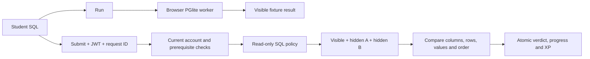

# Navigation, maps and performance review

Reviewed 4 September 2026 against `build/foundation`. This describes source and local behavior, not an approved hosted release.

## App paths and navigation

This is a single-page application without a route library. There are no separate `/map`, `/leaderboard`, `/admin` or `/ruins/1` pages.

| Entry | What it opens | Access |
| --- | --- | --- |
| `/` or `/#` | Intro, sign-in and game shell | Approved signed-in players; DEV offline bypass available |
| `/#admin` | Question Studio with a visual progression route, fixtures, answers and local JSON editing/export | DEV build only; excluded from student production assets |
| World map button | Personal district/ruin selector modal | In-game; server clearance controls signed-in access |
| Leaderboard button | Top 20 completers plus personal rank modal | Signed-in approved players |
| Admin button | Player table and question-review modal | Server-allowlisted admins; each protected read is audited |
| Archive arrows/dropdown | First-pass/current archive or a cleared ruin's alternate practice question | Sequential unlock rules; selection is component state, not a URL |
| Fullscreen button | Browser fullscreen for the complete game or DEV studio | Available where the browser supports the Fullscreen API |

Supabase receives `POST /functions/v1/judge-query`. Browser gameplay uses `/rest/v1/rpc/game_state`, `game_action`, `begin_revisit`, `completion_leaderboard`, `admin_players` and `admin_question`. These are Supabase API paths, not pages on the static web host. Google login returns to the web origin.

Cloudflare is configured with SPA fallback: an unknown web path may load the app shell, but it does not create a distinct route. `#admin` is only a DEV authoring switch; it does not grant production administrator access.

## Repository paths

| Folder | Responsibility |
| --- | --- |
| `src/App.tsx`, `src/game/GameEntry.tsx` | Game shell, sign-in, progression and panel orchestration |
| `src/game/` | 3D world, Soldier, maps, intro, gameplay helpers and community panels |
| `src/components/` | Shared controls and result display |
| `src/admin/` | DEV-only Question Studio |
| `src/db/` | Browser PostgreSQL worker and visible fixture setup |
| `src/sql/` | Local SQL policy and result comparison |
| `src/lib/` | Supabase client, RPC calls and submission retry IDs |
| `src/questions/` | Authoring catalog and generated visible/revisit content |
| `scripts/` | Content generators, regression tests, browser checks and disposable database benchmarks |
| `supabase/functions/` | Authenticated judge, AST validation and result comparison |
| `supabase/migrations/`, `supabase/tests/` | Private fixtures, server gameplay, grants/RLS and database checks |
| `public/` | Static assets, including the Soldier model |
| `docs/`, `.github/workflows/` | Team documentation and CI/release workflows |

## Map review

- **Player map:** visually styled cards, grouped into seven districts. Green/check-mark cards are restored, amber is current, and dimmed/locked cards are future ruins. It is useful as a progress selector, but has no illustrated terrain, geographic positioning, connected route or player-position marker.
- **DEV admin map:** a genuine SVG diagram with colored ruin nodes and a dotted, winding progression route. It is a curriculum diagram, not Delhi geography. Clicking a node opens detailed authoring content.
- **Production admin:** a protected table and question-review panel. It has no dedicated visual cohort/world map. Admins who play also have the normal personal player map.
- **World relationship:** the infinite tiled 3D world repeats the same environment/amber. Choosing another curriculum archive changes the question, not a distinct geographic destination in the scene.
- **Review findings:** below 820px, the mission card and its only World map button are hidden; player map access needs a compact-layout entry. The DEV studio's legacy `live`/`draft` badges and fixture checklist are catalog flags, not current generated-fixture or deployment evidence. They can misleadingly show “needs fixtures” for questions that now have fixtures. Neither map provides a trapped modal keyboard focus experience yet.

Fullscreen entry and the explicit exit control were checked interactively in both the game and DEV studio. Browser-native fullscreen changes update the button; unsupported browsers show a disabled control and failures show a short explanation.

## How a student's SQL is evaluated

The editor accepts PostgreSQL SQL, not `psql` terminal commands such as `\\dt`, `\\copy` or shell commands.

**Run** loads the selected question's public fixture into browser PostgreSQL and executes a permitted query in a read-only transaction with a 900ms statement timeout. The output is compared with the visible expected result. It is free and unlimited, and never awards official progression. Only DEV offline practice uses a visible pass to advance its local preview.

**Submit** sends SQL, ruin ID, dataset version, `first-pass` variant and a persistent retry UUID with the Supabase JWT. The judge verifies the token, confirmed Google identity, current approved domain/admin policy and sequential prerequisites. It obtains a per-player lease and checks for a cached verdict.

The PostgreSQL AST parser permits one `SELECT`/`WITH … SELECT` and curriculum-safe tables/functions. It rejects writes, multiple statements, forbidden relations/functions and unsafe structures. The database execution identity has only fixture SELECT grants and no progress-writing privilege.

The same SQL executes against three isolated datasets: visible, hidden A and hidden B. The server compares the exact required column names/order, row count, values, duplicate multiplicity, NULLs and required row ordering. Numeric wire values are normalized without decimal precision loss. All three cases must pass. This compares behavior, not similarity to the canonical SQL; equivalent safe queries are accepted. A query that merely hard-codes the visible result should fail changed hidden datasets.

A separate privileged function records the attempt and updates progression atomically. A first solve awards 20 XP (and the one-time 5 XP survey if it was not already recorded), unlocks the next ruin and stamps first completion when all 20 are solved. Wrong answers cost nothing. Repeated request IDs cannot double-award XP, and changing SQL under a used ID is rejected. The browser receives a verdict/count/XP and refreshes its server state; it does not receive hidden rows or canonical answers.

## Performance findings

### Measured

The clean repeat used one local Node judge and disposable PostgreSQL, three seconds per stage, without competing browser/unit tests. All 1,125 submissions were correct:

| Arrival rate | p50 | p95 |
| --- | --- | --- |
| 25/s | 9ms | 34ms |
| 50/s | 6ms | 8ms |
| 100/s | 4ms | 9ms |
| 200/s | 4ms | 8ms |

See [current load evidence](local-load-results.json). The earlier run recorded 16,911ms p95 at 200/s while the laptop was also being used for browser/test work. That slow result did not reproduce in the clean run; contention is a likely contributor, not a proven attribution. The warm later stages can be faster than the first stage. Neither three-second run establishes sustained capacity.

A separate [duration profile](local-profile-results.json) sent 200 first-ruin requests simultaneously: all passed, total elapsed 356ms and p95 345ms. Aggregate PostgreSQL protocol durations were approximately 14ms for authorization, 48ms for preparation, 18ms for student SQL, 11ms for transaction setup/commit and 70ms for recording. These are aggregate server times across 200 submissions, not per-request latencies. End-to-end time also includes Node queueing, network/protocol work and processing. Recording/preparation consumed more server time than these tiny student queries.

Run `pnpm test:profile` to reproduce the duration diagnostic. It enables statement-duration logging only in the disposable local cluster and writes aggregate measurements; it never profiles the hosted database or copies raw SQL logs into the repository.

Both workloads exercise first-ruin load, not a realistic mix of expensive later queries, and exclude hosted HTTP, Edge isolates and Supavisor. No cloud capacity conclusion follows from these local numbers.

### Structural bottlenecks and next actions

1. **Judge connection queue.** One executor connection and one progress connection are allowed per warm judge instance. Every submission runs three case transactions. Each case separately awaits BEGIN, three SET commands, a describe step, cursor execution and COMMIT. Concurrent submissions queue behind this work, as the simultaneous-burst profile shows, but the clean local 200/s run did not saturate it. Real network latency would add to the many serial exchanges. Reduce redundant round trips and instrument queue time before considering bounded concurrency; raising connections blindly can overwhelm the free database.
2. **Lease versus queue duration.** The lease expires after five seconds. The contended run exceeded sixteen seconds, even though the clean repeat was much faster. A retry after expiry can duplicate expensive work, even though final recording still prevents duplicate XP. Add bounded admission/queue time and a lease strategy consistent with actual execution time.
3. **Background progress traffic.** Every signed-in tab polls the full `game_state` every 30 seconds, including while idle. At 3,000 open tabs that is about 100 RPC calls/second before any submissions, with synchronized bursts possible. Refresh on meaningful events/focus, pause hidden tabs and add backoff/jitter or a carefully budgeted synchronization mechanism.
4. **Browser render load.** Movement pauses while editing, but the full animation/shadow/bloom render loop continues. The world has 81,000 instanced grass blades, nine repeated tiles, 2× maximum pixel ratio and a 2048² shadow map. Fullscreen can increase pixel work further. Keep the infinite world, but reduce render frequency when overlays are open and profile adaptive pixel ratio/shadow quality and tile-level culling. This is a code-derived GPU hypothesis, not a measured frame-time attribution.
5. **First download and startup.** The current build contains roughly 10.1MB PGlite WASM, 6.3MB PostgreSQL data, 1.21MB main JS and a 2.16MB Soldier GLB before compression. Local gzip estimates for these four files total about 7.3MB, excluding the worker/other assets; actual hosted encoding/cache behavior is unmeasured. At cohort scale this can bottleneck campus Wi-Fi. Measure actual transferred bytes/cache hits and preload before the start; keep PostgreSQL work off the main thread.
6. **Costly SQL/result growth.** Statement and row limits help but do not bound all memory/output costs. There is no planner-cost ceiling or result-byte cap, and local Run fetches the whole result. Test adversarial joins, recursion/aggregates and large values; bound output and admission before expanding concurrency.
7. **Smaller avoidable work.** Manifest JSON is rebuilt/fetched for every submit; leaderboard ranking is recomputed on reads; the admin panel refetches players and the question together when either page or ruin changes. Cache immutable versioned manifests, benchmark leaderboard queries and separate admin fetch dependencies after the primary queueing/render issues.

The authoritative `latency_ms` field starts after initial authorization and is captured before verdict recording. It is not end-to-end latency; operational dashboards should measure total request time and separate queue, policy, execution and recording phases.
